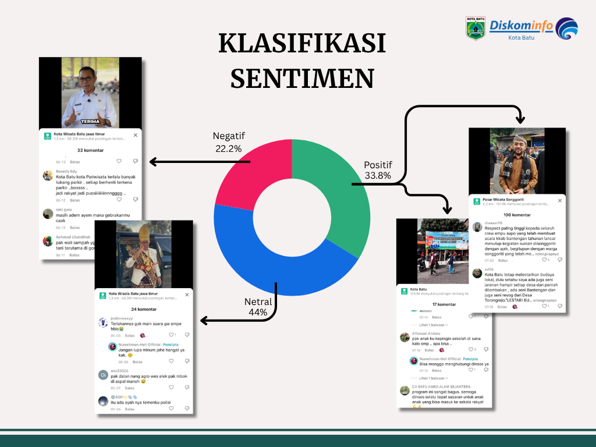
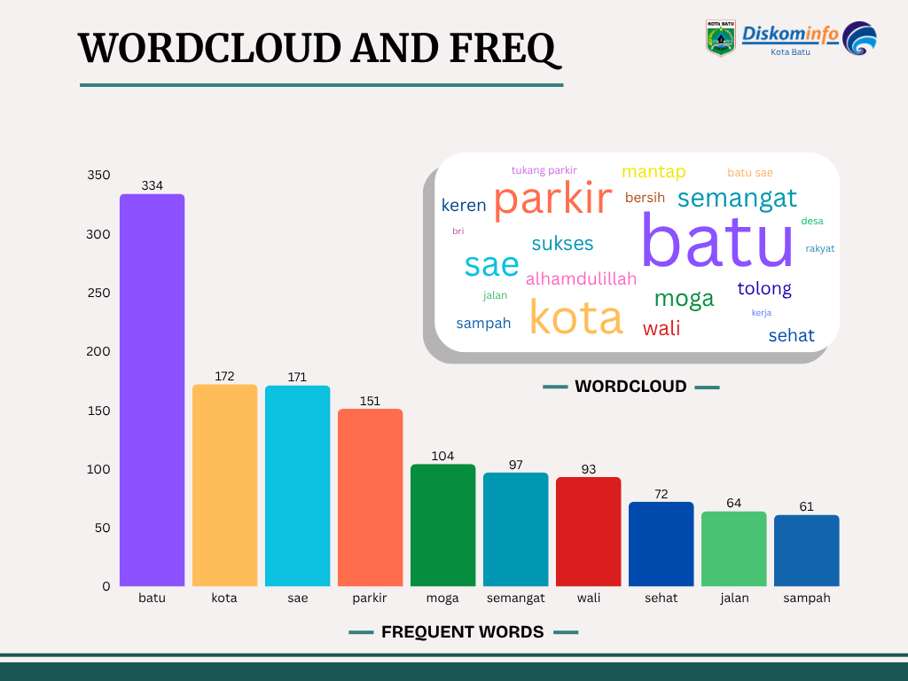
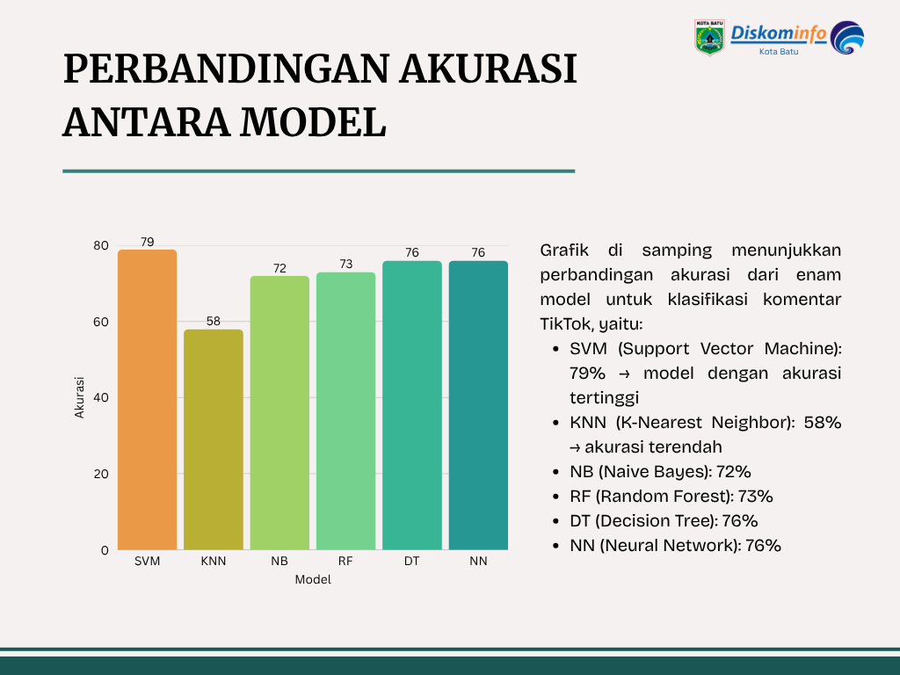

<div align="center">

# 📊 Sentiment Analysis of TikTok Comments on Batu City Government

### Machine Learning-Based Public Opinion Analysis for Government Communication Evaluation



<br>


### 🟢 Core Project | Internship Project (DISKOMINFO Kota Batu) 2025

[](https://canva.link/2twsf1ms0kozj70)

</div>

---

# 🧠 Project Overview

This project analyzes public sentiment toward TikTok content published by the Batu City Government using Natural Language Processing (NLP) and Machine Learning techniques.

The objective is to understand citizen opinions, identify dominant issues, and evaluate the effectiveness of government communication strategies through systematic analysis of social media comments.

This project was developed during an internship at **DISKOMINFO Kota Batu** and serves as a practical application of data science and machine learning for public sector analytics.

---

# 🎯 Project Objectives

- Collect and preprocess TikTok comments.
- Classify comments into Positive, Neutral, and Negative sentiment.
- Identify dominant keywords and emerging issues.
- Compare multiple machine learning algorithms.
- Evaluate government communication effectiveness.

---

# 🗂️ Dataset Overview

| Attribute | Value |
|---------|-------|
| Data Source | TikTok Comments |
| Total Comments | 1,647 |
| Sentiment Classes | Positive, Neutral, Negative |
| Domain | Government Social Media Analytics |
| Target Institution | Pemerintah Kota Batu |

---

# 🧪 Methodology

```text
Data Collection (TikTok Scraping)
        ↓
Data Cleaning & Preprocessing
        ↓
Exploratory Data Analysis (EDA)
        ↓
Text Feature Extraction
        ↓
Machine Learning Classification
        ↓
Model Evaluation & Comparison
        ↓
Strategic Insight Generation
```

---

# 📈 Sentiment Distribution


| Sentiment | Percentage |
|---------|-----------:|
| Positive | 33.8% |
| Neutral | 44.0% |
| Negative | 22.2% |

> 📌 Public responses are dominated by neutral sentiment, indicating that government content is largely informative, while opportunities remain to improve emotional engagement and public satisfaction.

---

# ☁️ Keyword Insight



Dominant keywords such as **batu**, **kota**, **sae**, and **parkir** indicate that parking-related issues and urban services are among the primary topics discussed by citizens.

---

# 📈 Model Performance



| Model | Accuracy |
|------|---------:|
| Support Vector Machine (SVM) | **79%** |
| Decision Tree (DT) | 76% |
| Neural Network (NN) | 76% |
| Random Forest (RF) | 73% |
| Naive Bayes (NB) | 72% |
| K-Nearest Neighbors (KNN) | 58% |

> 🏆 **Best Model:** Support Vector Machine (SVM)

---

# 🔍 Key Insights

- Neutral sentiment is the dominant public response.
- Parking-related issues are among the most discussed topics.
- SVM achieved the highest classification accuracy.
- Social media sentiment can be used to evaluate government communication effectiveness.

---

# 👨‍💻 My Role

This project was developed independently and included:

- Data collection and preprocessing
- Exploratory Data Analysis (EDA)
- NLP and feature engineering
- Machine learning model development
- Model evaluation and comparison
- Insight generation and reporting

---

# 🚧 Key Challenge

**Challenge:** Social media comments contained informal language, abbreviations, and inconsistent writing patterns.

**Solution:** Comprehensive preprocessing and feature extraction techniques were applied to normalize text and improve model performance.

---

# 💼 Business Impact

This analysis helps government institutions to:

- Understand public perceptions in real time.
- Identify emerging issues and citizen concerns.
- Evaluate digital communication strategies.
- Support evidence-based decision-making.

---

# 🛠️ Technology Stack

- Python
- Pandas
- Scikit-learn
- Natural Language Processing (NLP)
- Machine Learning
- Matplotlib
- WordCloud

---

# 🚀 Future Development

- Interactive Streamlit dashboard
- Real-time social media monitoring
- Automated sentiment reporting
- Topic modeling and issue detection

---

# 📑 Project Presentation

🔗 https://canva.link/2twsf1ms0kozj70

---

# 🎯 Career Relevance

Relevant for roles in:

- Data Analyst
- Data Scientist
- Machine Learning Engineer
- NLP Engineer
- Government Data Analyst
- Business Intelligence Analyst

---

# 👨‍💻 Author

**Muhammad Wildan Nabila**  
Informatics — Universitas Muhammadiyah Malang

---

<div align="center">

### 📊 Transforming Social Media Comments into Actionable Government Insights

</div>
